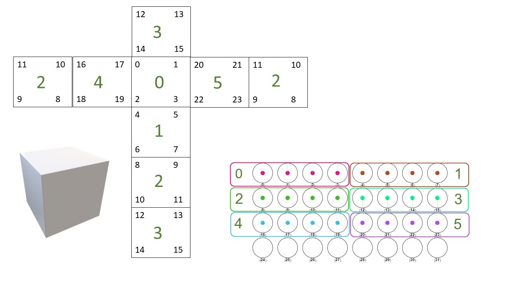

# RubiksCubeQuantumSolver

 *WIP*

This project is attempt to build a quantum solver for a Rubik's Cube.

Currently, the focus is to solve a mini-cube 2x2x2. The cube is represented by 5 qubit register, 2 qubits to represent the stickers on each face, and 3 qubits to differentiate between the different faces. The stickers of the cube are mapped to integer state representation (see image) and the color of each sticker determine by the phase of each state so state  amplitude ,   for White, Orange, Green, Red, Blue and Yellow respectively. The amplitude for each state is constant, and the state probability distribute evenly between the states .

For 2x2x2 cube we can span all of its state by 3 moves (we only care about relative movment): 
 - RotateLeft - while holding the cube when its front face is in front of us we spin its left side counter clockwise
 - RotateTop - while holding the cube when its front face is in front of us we spin its top side counter clockwise
 - RotateFace - while holding the cube when its front face is in front of us we spin its front side counter clockwise
