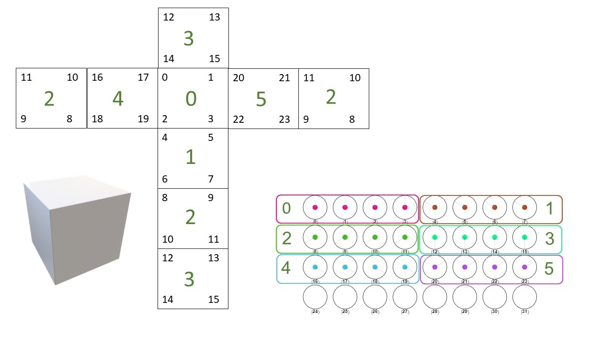

# RubiksCubeQuantumSolver

 *WIP*

This project is attempt to build a quantum solver for a Rubik's Cube.

Currently the focus is to solve a mini-cube 2x2x2. The cube is represented by 5 qubit register, 2 qubits to represnt the stikers on each face and 3 qubits to diffrantiate between the diffrent faces. The stikers of the cube are mapped to integer state represntation (see image) and the color of each stikker determine by phase of each state so state  amplitude ,  for white, blue, red, yellow, green and purple respectively. The amplitude of each state is constant, and the state pobarility distribute evenly between the states .

